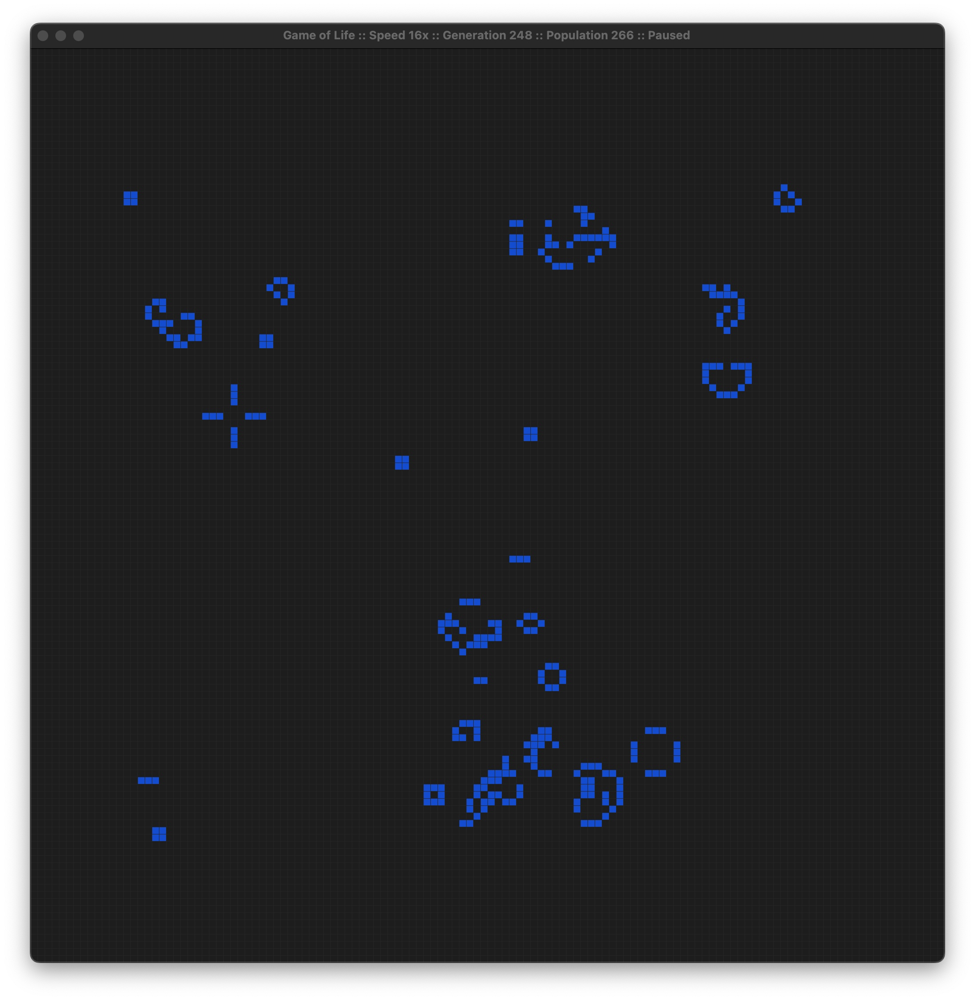

# Conway's Game of Life

A simple implementation of [Conway's Game of Life](https://en.wikipedia.org/wiki/Conway%27s_Game_of_Life) in Rust. 

## Controls

### Keyboard

* **Spacebar**: Pause/resume the simulation
* **1-6**: Set simulation speed
* **R**: Reset the simulation with a random pattern
* **C**: Reset the simulation and clear the board
* **ESC** Exit the application

### Mouse

When the simulation is paused, use the **left mouse** button to activate cells and the **right mouse** button to clear cells.

## Building the simulator

Building the simulator requires [Rust](https://www.rust-lang.org/tools/install) 

To run the simulator execute `cargo run`

### MacOS app bundle

To build the macOS app bundle:

`cargo bundle --release --target x86_64-apple-darwin`

This requires cargo-bundle, you can install it with cargo:

`cargo install cargo-bundle`

### Windows executable

To crosscompile for Windows with [Docker](https://docs.docker.com/engine/install/) create the build container first:

`docker build . -t rust_cross_compile/windows -f ./assets/Dockerfile.windows`

and then use the container to build the application: 

``
docker run --rm -ti -v `pwd`:/app rust_cross_compile/windows
``
